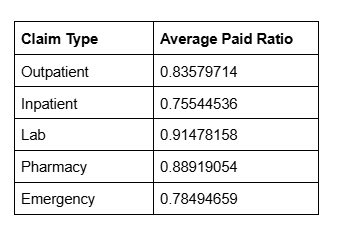
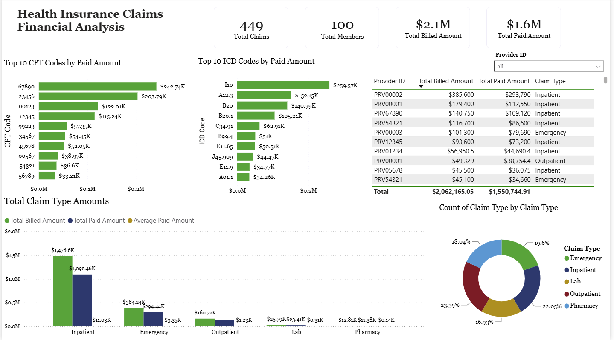

# Project Background

This project reviews the health insurance claims financials to help the C-Level Executives understand what factors such as CPT & ICD codes and claim types are driving high costs, and to uncover any gaps between billing and accounts receivable. 

Using SQL for modeling and calculation logic and Power BI for interactive reporting, this analysis is designed to analyze and break down healthcare spending to understand which services, procedures, and members drive the highest costs. 

Targeted SQL queries regarding various business questions can be found [here](HealthcareClaims.sql).

# Data Structure & Initial Checks
The main database structure, as seen below, consists of one table: Claims, with a total row count of 464 records. 

# Overview of Findings
- **Inpatient care is the most expensive claim type**, with a total billed amount of **$1,456,302** across **97 claims**. Although outpatient care has more total claims, it ranks 3rd in total cost at **$160,722** across **105 claims**.
  - This makes sense, as inpatient care requires 24/7 staffing to accommodate patients.

- The CPT code with the highest total paid amount is **67890**, at **$242,735** total paid — **74%** of its total billed amount of **$328,030**. The highest total paid ICD code is **I10**, with **$249,766** total paid — **79%** of its total billed amount of **$317,030**.
  - Although CPT code 67890 has the highest total paid amount, it ranks only **17th** by average paid per claim. The CPT code with the highest average paid per claim is **36512**, averaging **$25,600** per claim — which aligns with inpatient care, typically the most expensive claim type.

- The average paid ratio per claim type is shown in the table below. Additional information is needed to determine what these ratios actually mean, but they could serve as a benchmark. The pay ratio can vary depending on factors such as denials, write-offs, and/or billing errors.
   - The Lab and Pharmacy claim types have ratios closer to 1, as their billed and paid amounts are almost always closer together due to minimal markup over cost.

- There should be a focus on increasing the total paid amount of inpatient claims. As the most expensive claim type, it also has the greatest potential to increase revenue compared to any other claim type. Currently, inpatient sits at the lowest average paid ratio.

Below is an image from the PowerBI dashboard. The entire interactive dashboard can be downloaded [here](Healthcare%20Insurance%20Claims.pbix)

